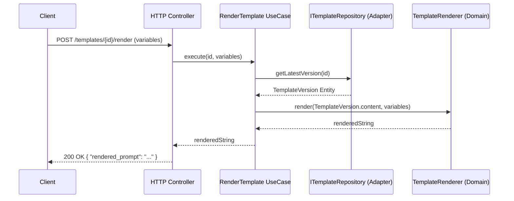

## Data Model & Versioning Strategy

The data model is designed to separate the identity and global metadata of a template (which remain stable) from its content and variables (which evolve over time). This allows us to meet the strict versioning requirements outlined in the PRD.

### Entities

#### 1. `Template`
Represents the root identity of a prompt template.

| Field | Type | Constraints | Description |
| :--- | :--- | :--- | :--- |
| `id` | String (UUID) | Primary Key | Unique identifier of the template. |
| `name` | String | Not Null | Name of the template (used for searching). |
| `tags` | String[] | Optional | List of tags for categorization and filtering. |
| `created_at` | Datetime | Not Null, Default: NOW() | Creation date and time of the root template. |

#### 2. `TemplateVersion`
Represents a specific and immutable iteration of a template's content.

| Field | Type | Constraints | Description |
| :--- | :--- | :--- | :--- |
| `id` | String (UUID) | Primary Key | Unique identifier of the version. |
| `template_id` | String (UUID) | Foreign Key, Not Null | Reference to the parent `Template`. |
| `version` | Integer | Not Null | Version number (e.g., 1, 2, 3...). |
| `variables` | JSON | Optional | Declaration of expected variables. Expected format: array of objects `[{"name": "string", "default": "string"}]`. |
| `content` | String | Not Null | The text content of the prompt containing `{{variable}}` placeholders. |
| `created_at` | Datetime | Not Null, Default: NOW() | Creation date and time of this specific version. |

### Relationships
*   **One-to-Many (1:N)**: A `Template` has one or more `TemplateVersion`s.
*   The relationship is established via the `template_id` field in the `TemplateVersion` entity, which points to the `id` of the `Template` entity.

### Versioning Strategy

1.  **Creation (Create)**: When a template is created, the system inserts a record into the `Template` table and simultaneously creates the first record in the `TemplateVersion` table with `version = 1`.
2.  **Update**: `TemplateVersion` records are **immutable** (Append-only). When updating a template's content or variables, the `Template` record remains intact, and a *new* `TemplateVersion` entry is inserted with `version = MAX(version) + 1` for that specific `template_id`.
3.  **Retrieve Latest Version**: By default, fetching a template retrieves the `Template` entity along with the associated `TemplateVersion` that has the highest `version` number.
4.  **Retrieve a Historical Version**: To get a specific older version, the system queries a `TemplateVersion` by filtering on both the `template_id` and the specific `version` number requested.

## Architecture Overview

We need high testability and the ability to expose the rendering logic to internal services outside of HTTP—the application follows a **Clean Architecture / Hexagonal Architecture (Ports & Adapters)** pattern. 

This ensures a strict separation of concerns where the core business logic is completely isolated from external frameworks, databases, and delivery mechanisms (HTTP).

### Layer Breakdown

#### 1. Domain Layer (The Core)
This layer contains the pure business rules and state. It has **zero dependencies** on any other layer or external library.
*   **Entities:** `Template` and `TemplateVersion`. These are pure data structures containing the business rules for what constitutes a valid template.
*   **Domain Services:** `TemplateRenderer`. A pure function/class responsible for the core logic of parsing a template string, replacing `{{variables}}`, and throwing specific domain errors if required variables are missing.
*   **Ports (Interfaces):** `ITemplateRepository`. Defines the contract for how templates are saved and retrieved, without knowing *how* it's implemented.

#### 2. Application Layer (Use Cases)
This layer orchestrates the flow of data to and from the Domain entities. It acts as the entry point for any consumer (HTTP API, CLI, or future internal microservices).
*   **Use Cases:** Classes like `CreateTemplate`, `RenderTemplate`, `GetTemplate`, and `UpdateTemplate`.
*   **Responsibility:** A use case typically fetches data via a repository interface, passes it to a domain entity/service to perform business logic, and returns the result. 
*   *Note:* By isolating this layer, we guarantee that the `RenderTemplate` logic can be called internally by another service without going through the HTTP stack.

#### 3. Infrastructure Layer (Outer Ring)
This layer contains all the implementation details and external integrations. Dependencies point *inward* toward the Application and Domain layers.
*   **Driving Adapters (Delivery):** The `HTTP Controller` (e.g., Express/FastAPI routers). It parses incoming HTTP requests, validates payloads using **DTOs (Data Transfer Objects)**, calls the appropriate Application Use Case, and formats the output back into HTTP responses (JSON + Status Codes).
*   **Driven Adapters (Persistence):** The concrete implementation of the `ITemplateRepository` (e.g., `InMemoryTemplateRepository` for initial development/testing, or `PostgresTemplateRepository` for production).

### Data Flow Example (Rendering a Template)



## Endpoint Contracts

### 1. Create a Template
Creates a new template and automatically generates its first version (`version: 1`).

*   **Method:** `POST`
*   **Path:** `/templates`
*   **Request Schema (JSON):**
    ```json
    {
      "name": "string (required)",
      "tags": ["string"] "(optional)",
      "content": "string (required) - e.g., 'Hello {{name}}'",
      "variables":[
        {
          "name": "string (required)",
          "default": "string (optional)"
        }
      ] "(optional)"
    }
    ```
*   **Response Schema (JSON):**
    ```json
    {
      "id": "uuid",
      "name": "string",
      "tags": ["string"],
      "created_at": "datetime",
      "version": {
        "id": "uuid",
        "version": 1,
        "content": "string",
        "variables": [...],
        "created_at": "datetime"
      }
    }
    ```
*   **Status Codes:**
    *   `201 Created`: Successfully created.
    *   `400 Bad Request`: Invalid payload (e.g., missing name or content).

---

### 2. Retrieve a Template
Retrieves a specific template. Returns the latest version by default, or a specific historical version if the `version` query parameter is provided.

*   **Method:** `GET`
*   **Path:** `/templates/:id`
*   **Query Parameters:**
    *   `version` (integer, optional): The specific version number to retrieve.
*   **Request Payload:** *None* (GET requests should not have a body).
*   **Response Schema (JSON):**
    ```json
    {
      "id": "uuid",
      "name": "string",
      "tags": ["string"],
      "created_at": "datetime",
      "version": {
        "id": "uuid",
        "version": "integer (latest or requested)",
        "content": "string",
        "variables": [...],
        "created_at": "datetime"
      }
    }
    ```
*   **Status Codes:**
    *   `200 OK`: Successfully retrieved.
    *   `404 Not Found`: Template ID does not exist, or the requested version number does not exist for this template.

---

### 3. List & Filter Templates
Retrieves a list of templates. Returns the metadata and the latest version of each template.

*   **Method:** `GET`
*   **Path:** `/templates`
*   **Query Parameters:**
    *   `tags` (string, optional): Comma-separated list of tags to filter by (e.g., `?tags=sales,email`).
    *   `name` (string, optional): Partial or exact search string for the template name (e.g., `?name=greeting`).
*   **Response Schema (JSON):**
    ```json[
      {
        "id": "uuid",
        "name": "string",
        "tags": ["string"],
        "created_at": "datetime",
        "latest_version": {
          "version": "integer",
          "content": "string"
        }
      }
    ]
    ```
*   **Status Codes:**
    *   `200 OK`: Successfully retrieved (returns an empty array `[]` if no matches are found).

---

### 4. Update a Template (Create New Version)
Appends a new immutable version to an existing template.

*   **Method:** `PUT` (or `POST /templates/:id/versions`)
*   **Path:** `/templates/:id`
*   **Request Schema (JSON):**
    ```json
    {
      "content": "string (required) - The updated prompt content",
      "variables":[
        {
          "name": "string",
          "default": "string"
        }
      ] "(optional) - The updated list of variables"
    }
    ```
*   **Response Schema (JSON):**
    ```json
    {
      "id": "uuid",
      "name": "string",
      "tags": ["string"],
      "created_at": "datetime",
      "version": {
        "id": "uuid",
        "version": "integer (incremented by 1)",
        "content": "string",
        "variables": [...],
        "created_at": "datetime"
      }
    }
    ```
*   **Status Codes:**
    *   `201 Created` (or `200 OK`): Successfully created the new version.
    *   `400 Bad Request`: Invalid payload.
    *   `404 Not Found`: Template ID does not exist.

---

### 5. Render a template

*   **Method:** `POST`
*   **Path:** `/templates/:id/render`
*   **Request Schema (JSON):**
    ```json
    {
      "version": "integer (optional - defaults to latest)",
      "variables": {
        "variable_name_1": "value 1",
        "variable_name_2": "value 2"
      }
    }
    ```
*   **Response Schema (JSON):**
    ```json
    {
      "rendered_content": "string (the final prompt with replaced variables)"
    }
    ```
*   **Status Codes:**
    *   `200 OK`: Successfully rendered.
    *   `400 Bad Request`: Missing required variables (must list the missing ones in the error message).
    *   `404 Not Found`: Template or version not found.


## Testable Scenarios

### 1. Template Creation (`POST /templates`)

**Scenario: Successfully create a template with all fields (Happy Path)**
*   **Given** a valid payload containing a name, tags, content (`"Translate {{text}} to {{language}}"`), and declared variables (with `language` having a default value of `"English"`).
*   **When** the client sends a `POST` request to `/templates`.
*   **Then** the API responds with `201 Created`.
*   **And** the response contains the new template ID.
*   **And** the response includes a nested version object with `version: 1`.

**Scenario: Fail to create a template with missing required fields (Error Case)**
*   **Given** a payload missing the `content` field.
*   **When** the client sends a `POST` request to `/templates`.
*   **Then** the API responds with `400 Bad Request`.
*   **And** the error message indicates that `content` is required.

### 2. Template Retrieval (`GET /templates/:id`)

**Scenario: Retrieve the latest version by default (Happy Path)**
*   **Given** a template exists with ID `123` and has 3 versions.
*   **When** the client sends a `GET` request to `/templates/123`.
*   **Then** the API responds with `200 OK`.
*   **And** the returned template data includes the content and variables of `version: 3`.

**Scenario: Retrieve a specific historical version (Happy Path)**
*   **Given** a template exists with ID `123` and has 3 versions.
*   **When** the client sends a `GET` request to `/templates/123?version=1`.
*   **Then** the API responds with `200 OK`.
*   **And** the returned template data includes the content and variables of `version: 1`.

**Scenario: Retrieve a non-existent template or version (Error Case)**
*   **Given** a template exists with ID `123` but only has 1 version.
*   **When** the client sends a `GET` request to `/templates/123?version=99` (or a completely invalid ID).
*   **Then** the API responds with `404 Not Found`.

### 3. List & Filter Templates (`GET /templates`)

**Scenario: Filter templates by tag and name (Happy Path)**
*   **Given** the database contains templates named "Email Greeting" (tag: `email`), "Email Signoff" (tag: `email`), and "SQL Generator" (tag: `code`).
*   **When** the client sends a `GET` request to `/templates?tags=email&name=Greeting`.
*   **Then** the API responds with `200 OK`.
*   **And** the response array contains exactly one item: "Email Greeting".

**Scenario: Filter returns no results (Edge Case)**
*   **Given** the database contains various templates.
*   **When** the client sends a `GET` request to `/templates?tags=nonexistent_tag`.
*   **Then** the API responds with `200 OK`.
*   **And** the response is an empty array `

### 4. Update a Template / Create New Version (`PUT /templates/:id`)

**Scenario: Successfully update a template and increment version (Happy Path)**
*   **Given** an existing template with ID `123` currently at `version: 1`.
*   **When** the client sends a `PUT` request to `/templates/123` with a new `content` string and an updated `variables` list.
*   **Then** the API responds with `201 Created` (or `200 OK`).
*   **And** the response contains the template data with a new nested version object having `version: 2`.
*   **And** the original `version: 1` remains unmodified in the database.

**Scenario: Update a template without changing variables (Edge Case)**
*   **Given** an existing template with ID `123` that has declared variables.
*   **When** the client sends a `PUT` request to `/templates/123` with new `content` but omits the `variables` array in the payload.
*   **Then** the API responds with `201 Created` (or `200 OK`).
*   **And** a new version is created with an empty variables list (or inherits the previous ones, depending on your implementation choice documented in assumptions).

**Scenario: Attempt to update a non-existent template (Error Case)**
*   **Given** no template exists with ID `999`.
*   **When** the client sends a `PUT` request to `/templates/999` with valid content.
*   **Then** the API responds with `404 Not Found`.

### 5. Render a Template (`POST /templates/:id/render`)

**Scenario: Successfully render a template with all variables provided (Happy Path)**
*   **Given** a template with ID `123` and content `"Write a {{tone}} email to {{name}}"`.
*   **When** the client sends a `POST` request to `/templates/123/render` with payload `{"variables": {"tone": "polite", "name": "Alice"}}`.
*   **Then** the API responds with `200 OK`.
*   **And** the response body contains `"rendered_content": "Write a polite email to Alice"`.

**Scenario: Successfully render using default variable values (Happy Path)**
*   **Given** a template with ID `123` and content `"Translate to {{language}}"`, where the `language` variable has a default value of `"English"`.
*   **When** the client sends a `POST` request to `/templates/123/render` with an empty variables object `{"variables": {}}`.
*   **Then** the API responds with `200 OK`.
*   **And** the response body contains `"rendered_content": "Translate to English"`.

**Scenario: Ignore unknown variables provided in the request (Edge Case)**
*   **Given** a template with ID `123` and content `"Hello {{name}}"`.
*   **When** the client sends a `POST` request to `/templates/123/render` with payload `{"variables": {"name": "Bob", "age": 30, "role": "admin"}}`.
*   **Then** the API responds with `200 OK`.
*   **And** the response body contains `"rendered_content": "Hello Bob"`.
*   **And** the extra variables (`age`, `role`) do not cause an error.

**Scenario: Fail to render due to missing required variables (Error Case)**
*   **Given** a template with ID `123` and content `"Context: {{context}}, Task: {{task}}"`, with no default values defined.
*   **When** the client sends a `POST` request to `/templates/123/render` with payload `{"variables": {"context": "Sales data"}}` (missing `task`).
*   **Then** the API responds with `400 Bad Request`.
*   **And** the error message explicitly states that the `task` variable is missing.

**Scenario: Render a specific historical version (Edge Case)**
*   **Given** a template with ID `123` where `version: 1` is `"Hi {{name}}"` and `version: 2` is `"Greetings {{full_name}}"`.
*   **When** the client sends a `POST` request to `/templates/123/render` with payload `{"version": 1, "variables": {"name": "Alice"}}`.
*   **Then** the API responds with `200 OK`.
*   **And** the response body contains `"rendered_content": "Hi Alice"` (ignoring the latest version's format).

